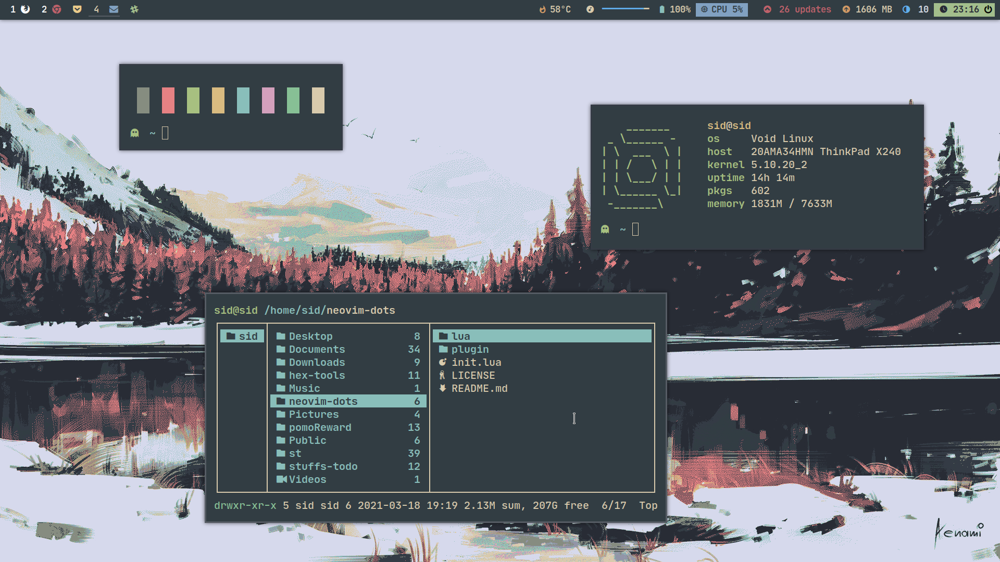

# Everforest - Xresources

## Installation

Detailed information about Xresources configurations can be found in the [Arch Linux Wiki](https://wiki.archlinux.org/index.php/X_resources) and [Wikipedia](https://en.wikipedia.org/wiki/X_resources).

### Manual

Copy the content of the [`everforest`](https://raw.githubusercontent.com/jef/everforest-xresources/main/everforest) file into the `~/.Xresources` or `~/.Xdefaults` file and reload the settings with `xrdb`.

### Via `#include`

Copy the [`everforest`](https://raw.githubusercontent.com/jef/everforest-xresources/main/everforest) file to any place and import it via `#include "/path/to/everforest"`.

### Via `merge`

To merge the color theme into your current settings copy the [`everforest`](https://raw.githubusercontent.com/jef/everforest-xresources/main/everforest) file to any place and run `xrdb -merge path/to/everforest`.

## Credits

Based off [sainnhe's Everforest](https://github.com/sainnhe/everforest).
